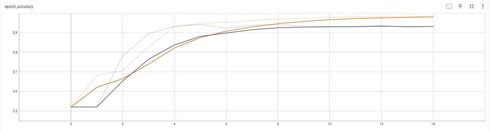

# A Comprehensive Method of Classifiying Text by Using Deep Learning Model.

## Project description

This aim of thisproject is to classify the type of news. There are 2 types of news that that this dataset can be classified to, which is either Political News or World News.
These are steps used to complete this project.
 
#### 1. Data Loading
    - Loaded csv dataset by using pandas load_csv()
#### 2. Data Inspection
    - Inspected the text data for the info, duplicates and missing data. 
#### 3. Data Cleaning
    - Removed duplicates and missing data by using pandas
    - Removed links, special characters and any unwanted characters in the text dataset by using Regex
#### 4. Feature Selection
    - Selected the features and target of the dataset for model training
#### 5. Data Preprocessing
    - Used Tokenizer and Pad_sequences to normalize features
    - The target was normalized by using One Hot Encoding
#### 6. Model Development
    - Created a model using Tensorflow Long Short-Term Memory (LSTM) with 2 layers and train the model with 15 epochs because the hardware were a bit lacking. 
    (*Do increase the nodes, layers and epoch for a better results)
    - Used TensorBoard callbacks to prevent overfitting.
#### 7. Model Evaluation
    - Evaluated the model by using confusion matrix and classification report.
#### 8. Save the Model
    -  Saved the model 
 
## Results

    - The model accuracy is above 90%. This model did a great job of classifiying politics and world news.

## Acknowledgement
The dataset used for this project is by *[CLÉMENT BISAILLON](https://www.kaggle.com/datasets/clmentbisaillon/fake-and-real-news-dataset)*
